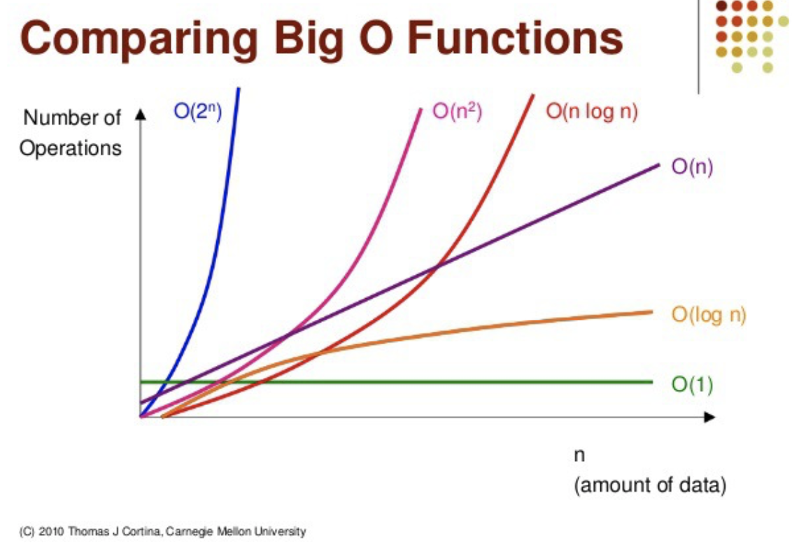

# 시간 복잡도
알고리즘의 수행 시간을 분석할 때 사용한다. 알고리즘의 수행 시간은 실행 환경에 따라 다르게 측정되기 때문에 기본 연산의 실행 횟수로 평가한다.

### 기본 연산
데이터 입출력, 산술 연산, 제어 연산 등이 포함된다.

## 시간 복잡도는 왜 거의 Big-O 표기법을 사용할까
빅오메가, 빅세타 등 다양한 표기법이 있는데 빅오 표기법을 주로 사용하는 이유는 최악의 경우를 고려하기 때문이다. 최악의 경우를 기준으로 하기 때문에 모든 경우가 다 포함되어 있다. 그리고 최악의 경우에서 성능을 알 수 있다면 적어도 최악의 경우가 아닐 땐 이 이상의 성능은 보장한다는 것이기 때문이다.

# Big-O 표기법
빅오 표기법은 점근적 상한을 나타낸다. 입력의 크기가 극한으로 증가할 때 최고 차항의 차수가 가장 영향을 많이 끼치기 때문에 가장 높은 항을 제외하고 다른 항은 다 제거하는 표기법이다.

즉, 시간복잡도에 가장 큰 영향을 미치는 차항으로 시간복잡도를 나타내는 표기법이다.

## 특징
### 1. 상수항은 무시한다.
```
O(2n) -> O(n)
```

### 2. 큰 항 이외의 항은 무시한다.
```
O(2n^2 + 2n + 2) -> O(N^2)
```

## 성능 비교


O(1) < O(log n) < O(n) < O(nlog n) < O(n^2) < O(2^n)<br>
(상수 < 로그 < 선형 < 다항 < 지수)<br>

왼쪽에서 오른쪽으로 갈 수록 효율성이 떨어지고 있다.

--- 

[^1] https://en.wikipedia.org/wiki/Big_O_notation
[^2] https://medium.com/interviewnoodle/the-big-o-notation-42fb66bc3152
[^3] https://www.javatpoint.com/big-O-notation-in-data-structure
[^4] https://realpython.com/sorting-algorithms-python/#the-importance-of-sorting-algorithms-in-python

