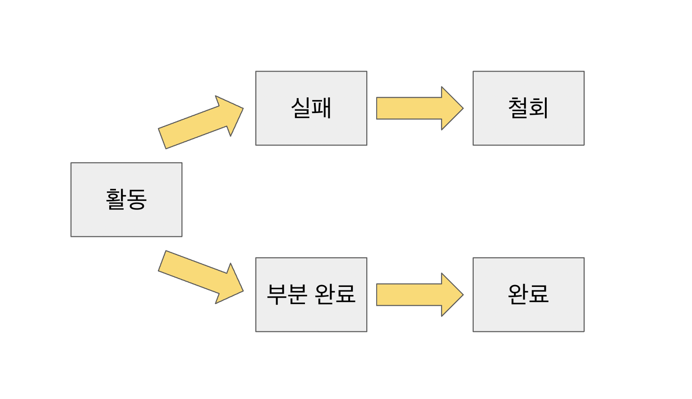

# Transaction
데이터베이스의 상태를 변환시키는 하나의 논리적 기능을 수행하기 위한 작업의 단위 또는 한번에 수행되야 하는 일련의 연산들을 의미한다.

## 트랜잭션 특징
- 트랜잭션은 데이터베이스 시스템에서 병행 제어 및 회복 작업 시 처리되는 작업의 논리적 단위이다.
- 사용자가 시스템에 대한 서비스 요구시 시스템이 응답하기 위한 상태 변환 과정의 작업단위이다.
- 하나의 트랜잭션은 커밋되거나 롤백된다.

## 트랜잭션 성질
### 원자성 - Atomicity
- 트랜잭션의 연산은 데이터베이스에 모두 반영되든지 아니면 전혀 반영되지 않아야 한다.
- 트랜잭션 내의 모든 명령은 반드시 완벽히 수행되어야 하며, 어느 하나라도 완벽히 수행되지 않고 오류가 발생하면 트랜잭션 전부가 취소되어야 한다.

### 일관성 - Consistency
- 트랜잭션이 그 실행을 성공적으로 완료하면 언제나 일관성 있는 데이터베이스 상태로 변환한다.
- 시스템이 가지고 있는 고정 요소는 트랜잭션 수행 전과 트랜잭션 수행 완료 후의 상태가 같아야 한다.

### 독립성, 격리성 - Isolation
- 둘 이상의 트랜잭션이 동시에 병행 실행되는 경우 어느 하나의 트랜잭션 실행 중에 다른 트랜잭션의 연산이 끼어들 수 없다.
- 수행 중인 트랜잭션은 완전히 완료될 때까지 다른 트랜잭션에서 수행 결과를 참조할 수 없다.

### 영속성, 지속성 - Durability
- 성공적으로 완료된 트랜잭션의 결과는 시스템이 고장나더라도 영구적으로 반영되어야 한다.

## 트랜잭셩 상태

- 활동(Active) : 트랜잭션이 실행중인 상태이다.
- 실패(Failed) : 트랜잭션 실행에 오류가 발생하여 중단된 상태이다.
- 철회(Aborted) : 트랜잭션이 비정상적으로 종료되어 롤백 연산을 수행한 상태이다.
- 부분 완료(Partially Committed) : 트랜잭션의 마지막 연산까지 실행하여 커밋 연산이 실행되기 직전의 상태이다.
- 완료(Committed) : 트랜잭션이 성공적으로 종료되어 커밋 연산을 실행한 후의 상태이다.

 ---

[^1] https://stackoverflow.com/questions/974596/what-is-a-database-transaction
