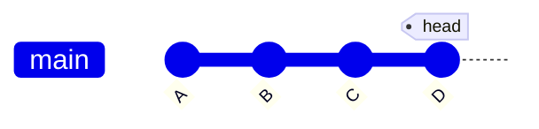
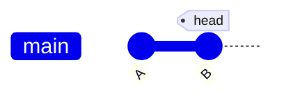
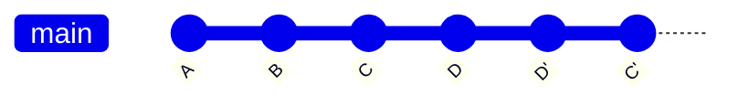

# git reset
특정 커밋으로 되돌린다. 현재 존재하는 커밋이 원래 없던 것처럼 과거 커밋으로 돌아갈 수 있다. 말 그대로 리셋하며, 아무런 이력을 남기지 않는다.
커밋 히스토리를 깔끔하게 유지할 수 있고, 혼자 작업할 때 편하게 되돌아갈 수 있지만 타인과 같은 브랜치에서 함께 작업할 때 커밋이 뒤섞여버릴 수 있다.

## 동작 모습
리셋을 하기 전 브랜치 상태

2번 커밋으로 리셋을 하고 난 뒤의 상태

### 옵션
- `--soft` : index 보존(add한 상태, staged 상태), 워킹 디렉토리 파일 보존한다.
- `--mixed` : index 취소(add하기 전 상태, unstaged 상태), 워킹 디렉토리 파일 보존한다. (default)
- `--hard` : index 취소(add하기 전 상태, unstaged 상태), 워킹 디렉토리 파일 삭제한다.

# git revert
이전 커밋 내역을 그대로 남겨둔 채 새로운 커밋을 생성한다. 즉, 커밋 히스토리가 사라지지 않고 남아있는 상태로 이전으로 돌아가게 된다.
따라서 중간에 무슨 문제가 있었는지, 왜 돌아갔는지 등의 기록이 가능하다. 또한 다른 사람과 같은 브랜치에서 함께 작업할 때 코드 충돌을 최소화할 수 있다.

## 동작 모습
리버트를 하기 전 브랜치 상태

2번 커밋으로 리버트 하고 난 뒤의 상태

# reset vs revert
두 명령어 모두 과거 커밋을 되돌리는데 사용하지만 reset의 경우에는 다른 사람과 공유하는 브랜치에서 사용은 지양해야 한다.
A와 B가 같은 브랜치를 공유하는 상황에서 A가 아무말 없이 커밋 이력을 삭제해 버린다면 B가 push를 할 때 충돌이나게 된다.
그렇기 때문에 협업하는 경우에는 이전 커밋으로 돌아갈 때 revert를 사용하는게 좋다.

---

[^1] https://stackoverflow.com/questions/8358035/whats-the-difference-between-git-revert-checkout-and-reset 
[^2] https://git-scm.com/book/ko/v2/Git-%EB%8F%84%EA%B5%AC-Reset-%EB%AA%85%ED%99%95%ED%9E%88-%EC%95%8C%EA%B3%A0-%EA%B0%80%EA%B8%B0
