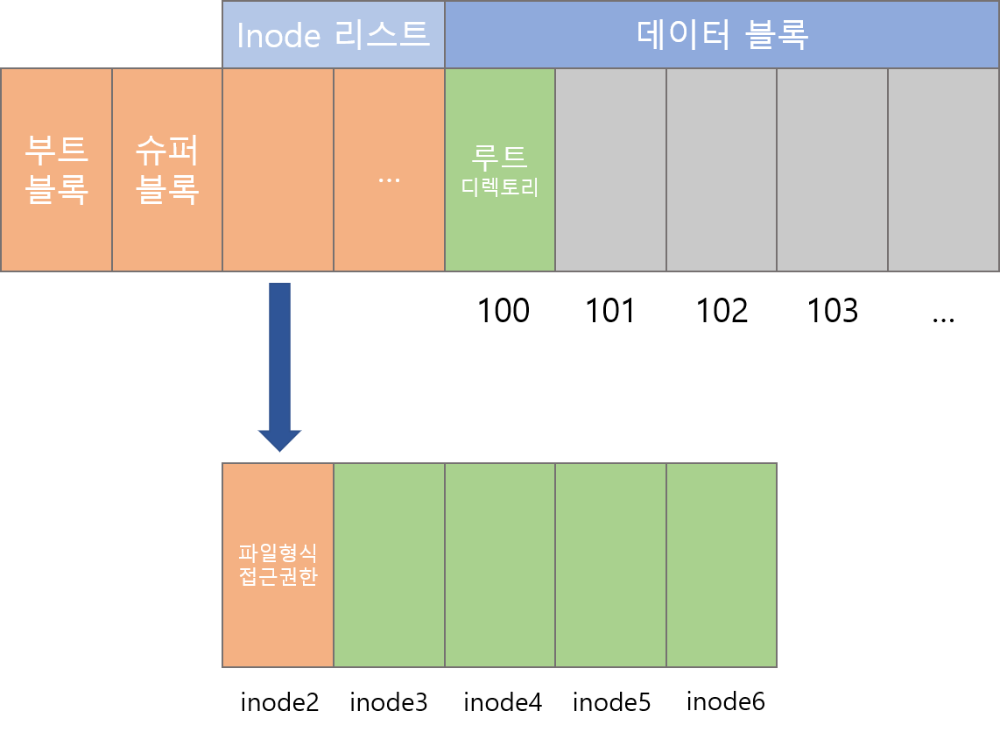

# File System
저장 장치 내에서 데이터를 읽고 쓰기 위해 미리 정해진 약속이다. 
사용자 영역이 아닌 커널 영역에서 동작한다.

## 파일 시스템이 하는 역할
- 접근 방법 : 저장된 데이터에 접근할 수 있는 방법 제공
- 파일 관리 : 저장, 참조, 공유
- 보조 저장소 관리 : 저장 공간 할당
- 파일 무결성 메커니즘 : 파일이 의도한 정보만 담고 있음을 의미

## 파일 시스템 구조

리눅스 파일 시스템의 구조는 부트블록으로 시작된다. 
부트 블록은 컴퓨터 시스템을 부팅하기 위한 부팅에 관련된 이미지를 갖고 있다.

리눅스 운영체제가 처음 실행되면 부트블록을 제일먼저 읽어서 리눅스를 가동한다. 부트블록이 주기억장치에 모두 올라가게 되면 리눅스 운영체제는 제일 처음 init 프로세스를 기동하게 되고, init 프로세스의 PID는 1번이 부여된다.

### 부트 블록
- 파일 시스템으로부터 리눅스 커널을 적재시키기 위한 프로그램이다.

### 슈퍼 블록
- 인덱스 정보를 가지고 있다.

### 데이터 블록
- 실제 데이터가 저장되어 있는 파일이다.

### inode
- 파일이나 디렉토리에 대한 모든 정보를 가지고 있다.

## 파일 시스템 종류
### 리눅스 전용 디스크 기반 파일 시스템
- EXT, EXT2, EXT3, EXT4

### 저널링 파일 시스템
- JFS, XFS, ReiserFS

### 네트워크 파일 시스템
- SMB, CIFS, NFS, EXT4

### 기타 파일 시스템
- FAT, VFAT, FAT32, NTFS, ISO 9660, UDF, HPFS
