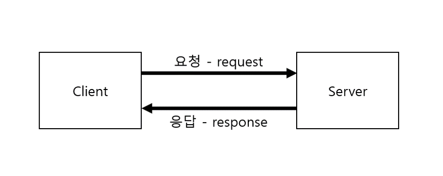

# HTTP
`HTML`과 같은 하이퍼미디어 문서를 전송하기 위한 응용 프로그램 계층 프로토콜이다.<br>
지금은 HTML 뿐만 아니라 거의 모든 것을 HTTP로 전송 가능하다.
<br>

> ### 전송 가능한 리소스
> 
> - HTML, TEXT, IMAGE, 음성, 영상, 파일, JSON, XML(API) 등 거의 모든 형태의 데이터 전송 가능하다.
> - 서버 간에 데이터를 주고 받을 때도 대부분 HTTP를 사용한다.
<br>

## HTTP 특징 [^1]
### Client-Server
> 클라이언트의 요청이 있을 때 서버가 응답하는 **`단방향 통신`** 이다.<br>
> 서버는 클라이언트에 요청을 하지 않고, 클라이언트가 보낸 요청에 대한 응답만 보낸다.



클라이언트에 요청에 따라 서버의 응답에는 요청 처리 결과에 따라 응답 코드가 다르게 온다.<br>
그래서 응답 코드에 따라 로직을 만들어 서버의 상황에 대한 대응이 가능하다.

```
ex. 로그인 요청을 하는데 해당 계정이 존재하지 않을 때, 서버는 해당 계정이 존재하지 않다는 응답을 보낸다.
이 때 클라이언트는 회원가입 페이지로 이동하게 설정할 수 있다.
```

### Stateless protocol
> 서버는 클라이언트의 상태를 저장하지 않는다.<br>
> 클라이언트가 이전에 했던 요청이 무엇인지에 상관없이 요청에 대한 응답만 한다는 뜻이다.

#### stateless가 왜 쓰이는 걸까?


### Connectionless


### HTTP 메시지


[^1] https://developer.mozilla.org/ko/docs/Web/HTTP/Overview
