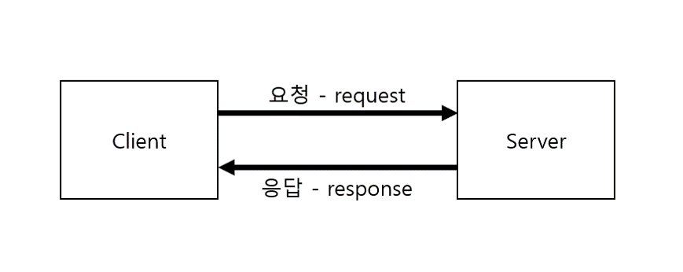

# HTTP
`HTML`과 같은 하이퍼미디어 문서를 전송하기 위한 응용 프로그램 계층 프로토콜이다.<br>
지금은 HTML 뿐만 아니라 거의 모든 것을 HTTP로 전송 가능하다.
<br>

> ### 전송 가능한 리소스
> 
> - HTML, TEXT, IMAGE, 음성, 영상, 파일, JSON, XML(API) 등 거의 모든 형태의 데이터 전송 가능하다.
> - 서버 간에 데이터를 주고 받을 때도 대부분 HTTP를 사용한다.
<br>

## HTTP 특징 [^1]
### Client-Server
> 클라이언트의 요청이 있을 때 서버가 응답하는 **`단방향 통신`** 이다.<br>
> 서버는 클라이언트에 요청을 하지 않고, 클라이언트가 보낸 요청에 대한 응답만 보낸다.



클라이언트의 요청에 따라 서버의 응답은 요청 처리 결과에 따라 응답 코드가 다르게 온다.<br>
그래서 응답 코드에 따라 로직을 만들어 서버의 상황에 대한 대응이 가능하다.

```
ex. 로그인 요청을 하는데 해당 계정이 존재하지 않을 때, 서버는 해당 계정이 존재하지 않다는 응답을 보낸다.
이 때 클라이언트는 회원가입 페이지로 이동하게 설정할 수 있다.
```

### Stateless protocol
> 서버는 **`클라이언트의 상태를 저장하지 않는다.`**<br>
> 클라이언트가 이전에 했던 요청이 무엇인지에 상관없이 요청에 대한 응답만 한다는 뜻이다.<br>
> <br>
> 보통 대규모 트래픽이 발생하는 서비스에서는 서버를 여러대 사용한다. 서버가 많아질 수록 서로 간에 정보를 공유하기 위한 비용이 비싸진다. stateless하게 사용할 경우 정보 공유가 최소화되어 **`정보를 공유하는 비용을 최소화`** 할 수 있다.


위의 그림처럼 stateless한 방식을 사용하면 클라이언트에서 이전에 요청한 정보를 저장해두고 해당 메시지를 다음 요청에서 같이 보내기 때문에, 이전 요청에 상관없이 받은 요청에 대한 응답을 보낼 수 있다.<br>
<br>
이 말이 어렵다면 stateless의 반대인 서버에 클라이언트의 상태를 저장하는 stateful한 방식을 알면 된다.


#### statelful한 방식


위의 그림은 stateful한 방식을 사용했다. 클라이언트는 서버에게 특정 영화의 시간 정보를 요청한 후 2자리를 예매하려고 한다. 이 때, 클라이언트가 요청한 특정 영화의 시간에 대해 알고 있다면, 클라이언트는 2자리를 예매한다는 요청만 서버에게 보내면 된다.<br>
<br>
하지만 서버가 하나가 아니라 여러개라면 비효율적이다. 만약 특정 영화의 시간 정보 요청을 3번 서버에서 받았다고 가정하고, 2자리 예매 요청을 81번 서버에서 받았다고 하자. 그럼 81번 서버는 클라이언트가 조회한 것을 알기 위해서는 다른 서버에 대해서 클라이언트가 영화 조회를 한 기록이 있는지 살펴봐야 한다. 만약 서버가 100개 있으면 99개의 서버를 다 돌아봐야 한다.<br>
<br>
즉 **`stateful한 방식`** 을 사용하면 **정보를 공유하기 위한 비용이 비싸기** 때문에 사용하지 않는다.


### Connectionless
> HTTP 통신은 **`연결을 유지하지 않는 것`** 을 기본 동작으로 한다.<br>
> 기본 동작으로는 연결을 유지하지 않지만 옵션을 설정하면 일정 기간동안 연결을 유지할 수 있다.

기본 동작으로 연결을 유지하지 않는 이유는 연결을 유지하게 되면 지속적으로 리소스가 사용되기 때문이다. 따라서 연결 유지는 최소화 하는게 좋다.

#### Connection을 유지하는 경우
HTTP 통신 초기에 서버는 응답 후에 바로 클라이언트의 연결을 끊어버렸다. 하지만 최근에는 연결을 맺고 끊는 것도 비용이 비싸다는 이유로 **`Keep Alive`** 옵션을 통해 일정 기간 동안 클라이언트와 연결을 유지하는 방법으로 통신이 가능해졌다.<br>
<br>
데이터를 자주 요청하는 경우 연결을 맺고 끊는 것을 여러번 하는 것보다는 일정 기간 동안 연결을 유지하는 방법을 사용하는 것이 비용이 절감된다.

---

[^1] https://developer.mozilla.org/ko/docs/Web/HTTP/Overview<br>


