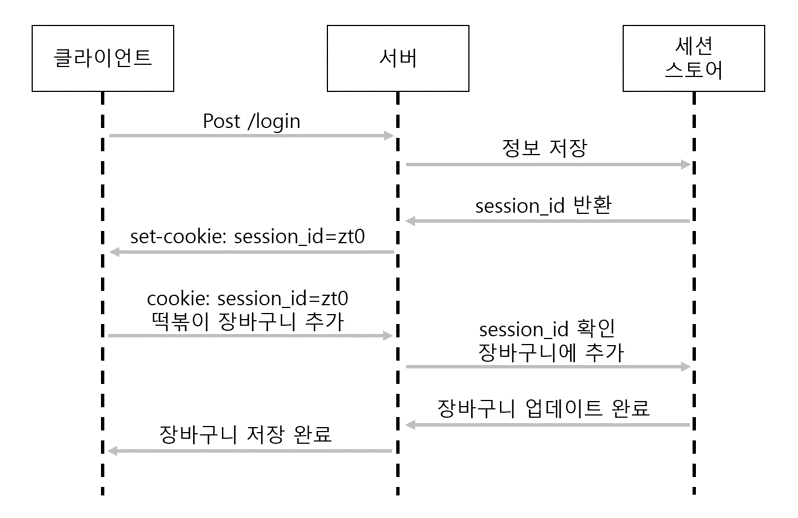

# Session
> ### 클라이언트 별로 각각의 상태를 서버에 저장하는 방식이다.
> 
> 서버는 response header의 set-cookie에 session_id 값을 보낸다.

### session이 생겨난 이유
cookie가 유출될 수 있다는 것을 인지해서 이를 보완하기 위해서다.

## 저장 방식
### In memory

### File storage

### Database storage

## 동작 방식

#### 1. 클라이언트가 서버에 자원을 요청한다.

#### 2. 서버에서는 HTTP Request의 헤더를 통해 session_id 를 확인한 후, 없으면 set-cookie를 통해 새로운 session_id를 보낸다.

#### 3. 클라이언트는 session_id를 포함해서 다시 서버에 자원을 요청한다.

#### 4. 서버는 session_id를 통해 해당 세션을 찾아 클라이언트 상태 정보를 유지하며 적절한 응답을 보낸다.

## 단점
- 쿠키에 담긴 정보로는 의미가 없지만, 쿠키의 정보를 이용해 서버에 요청을 보내면 정보가 유출될 수 있다. (세션 하이재킹)
- 서버에 정보를 저장해야 하기 때문에 메모리 공간을 차지한다.
- 쿠키로 부터 받은 session id로 세션 스토리지를 탐색하는데 시간이 든다.

---

[^1] https://doooyeon.github.io/2018/09/10/cookie-and-session.html 
[^2] https://chrisjune-13837.medium.com/web-%EC%BF%A0%ED%82%A4-%EC%84%B8%EC%85%98%EC%9D%B4%EB%9E%80-aa6bcb327582