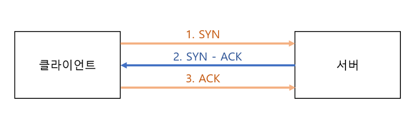
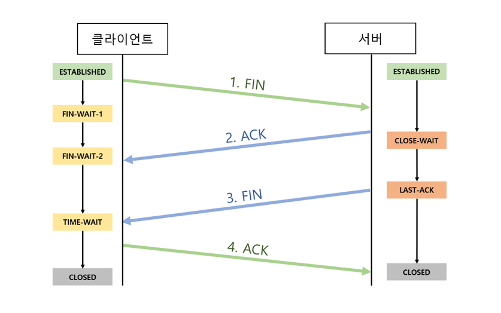

# TCP (Transmission Control Protocol)
> ### 서버와 클라이언트간에 데이터를 신뢰성 있게 전달하기 위해서 만들어진 프로토콜이다.
> - 데이터가 전달되는 과정에서 유실되거나 순서가 바뀔 수 있는데 TCP는 유실을 찾아내서 교정하고 순서를 재조합할 수 있게 해준다.
> - 전송 계층의 대표적인 연결지향 프로토콜이다.

## TCP 서비스
### 1. 신뢰성 있는, 순서대로 데이터가 간다.
즉, 데이터를 보낸 순서로 받을 수 있다.

### 2. 흐름 제어 - flow control
수신 측에서 받아들일 수 있는 속도에 맞춰서 송신 측의 데이터를 전달한다.

### 3. 혼잡 제어 - congestion control
네트워크 상황에 맞춰서 그 네트워크가 받을 수 있는 능력치만큼 보내준다.

## TCP 구조

#### 발신지 포트 (Source Port)
패킷을 송신하는 시스템의 포트 번호이다.

#### 목적지 포트 (Destination Port)
패킷을 수신하는 시스템의 포트 번호이다.

#### 순차 번호 (Sequence Number)
각 세그먼트의 첫 번째 바이트에 부여되는 번호이다.

#### 응답 확인 번호 (Acknowledge Number)
수신하기를 기대하는 다음 바이트 번호이다. (마지막 수신 성공 순서번호 + 1)

#### 헤더 길이 (Header Length)
TCP 헤더의 길이를 나타낸다.

#### TCP 제어 플래그 (TCP Control Flag)
각 필드 흐름 제어, 종료, 데이터 전송 모드용 구성이다.
- URN (긴급 플래그), ACK (응답 플래그), PSH (Push 플래그), RST (강제 연결 종료 플래그), SYN (연결 요청 플래그), FIN (연결 해제 플래그)

#### 윈도우 크기 (Window Size)
수신 윈도우의 보낼 수 있는 데이터의 양을 뜻한다.

#### 검사합 (Checksum)
데이터가 전송 중에 손실되지 않고 원본과 동일한지 검사할 때 사용한다.

#### 긴급 포인터 (Urgent Point)
세그먼트가 긴급 데이터를 포함하고 있을 경우를 알린다.

## 3 way handshake을 통한 연결 수립

### SYN (접속 요청)
클라이언트가 서버에게 통신을 위한 연결을 요청을 하기 위해서 SYN 데이터를 보낸다. 이때 클라이언트는 SYN-ACK 응답을 기다리는 SYN-SENT 상태가 된다.

### SYN-ACK (요청 수락)
서버에서 요청을 잘 받았다는 대답(ACK)과 클라이언트도 포트 열어달라는 SYN을 같이 보낸다.이때 서버는 SYN-RECEIVED 상태이다.

### ACK (수락 확인)
클라이언트는 SYN-ACK 응답을 받고 ESTABLISHED 상태가 된다. 그리고 서버에 요청을 잘 받았다는 ACK를 보낸다. 그럼 서버는 ESTABLISHED 상태가 된다.

## 4 way handshake를 통한 세션 종료

### FIN ()
클라이언트가 연결을 종료하겠다는 FIN을 전송한다. 이때, 클라이언트느 FIN-WAIT 상태가 된다.

### ACK
서버는 FIN플래그를 받았다는 ACK를 전송한다. 그리고 자신의 통신이 끝날 때까지 기다리는 CLOSE-WAIT 상태가 된다.

### FIN
연결 해제할 준비가 되었다고 클라이언트에게 FIN를 전송한다. 이때 서버의 상태는 LAST-ACK 이다.

### ACK
클라이언트는 FIN플래그를 잘 받았다는 ACK를 전송한다. 이때 클라이언트는 TIME-WAIT 상태가 된다.

#### TIME-WAIT 상태가 되는 이유는 뭘까
서버에서 FIN 플래그를 전송하기 전에 보냈던 패킷이 라우팅 지연이나, 유실로 FIN 보다 늦게 도착한 경우를 생각하면 된다. 클라이언트에서 FIN을 받았다고 바로 세션을 종료시킨다면 해당 패킷은 클라이언트에게 전해지지 않을 것이다. 이런 상황을 대비해서 클라이언트에서는 FIN을 받더라도 일정 시간동안 세션을 유지하고, 이 시간이 끝나면 세션을 만료시키고 종료하면서 CLOSED 상태가 된다.

# UDP (User Datagram Protocol)
> ### 비연결형 서비스이며, 신뢰성이 없는 프로토콜이다.
> - 정보를 주고 받을 떄 TCP 처럼 3 way handshake 같은 연결 과정을 갖지 않아 속도가 더 빠르다.
> - 비연결형 서비스로 1:1 통신, 1:N 통신, N:N 통신에서도 쉽게 사용할 수 있다.

## UDP 주요 기능
- Multiplexing, Demultiplexing
- checksum (선택)

## UDP 특징
- 전송 중에 손실될 수 있고, 보낸 순서대로 도착하지 않을 수 있다.
- 수신지에서 패킷을 받지 못했더라도 상관하지 않는다.
- 상대적으로 TCP 보다 간단하고 빠르다.

## UDP는 언제 사용될까
WebRTC를 이용한 실시간 스트리밍을 통해 동영상 데이터나, 음성을 전송하는 등의 정보의 신뢰성보다는 실시간성과 연속성, 속도 등이 더 중요한 경우에 많이 사용되고 있다.

## TCP와 UDP 공통점
- 포트 번호를 이용해서 주소를 지정한다.
- 데이터 오류 검사를 위한 checksum이 존재한다.

## TCP와 UDP 차이점
|TCP|UDP|
|:---:|:---:|
|연결을 해야 통신이 가능한 **`연결형`** 프로토콜|연결을 하지 않아도 통신이 가능한 **`비연결형`** 프로토콜|

|신뢰성 있는 데이터 전송|신뢰성 없는 데이터 전송|
|1:1 통신 (Unicast)|1:1 통신 (Unicast), 1:N 통신 (Broadcast), N:N 통신 (Multicast)

---

[^1] http://www.kocw.net/home/search/kemView.do?kemId=1169634 
[^2] https://www.inflearn.com/course/http-%EC%9B%B9-%EB%84%A4%ED%8A%B8%EC%9B%8C%ED%81%AC/dashboard 
[^3] http://www.ktword.co.kr/test/view/view.php?m_temp1=1889
