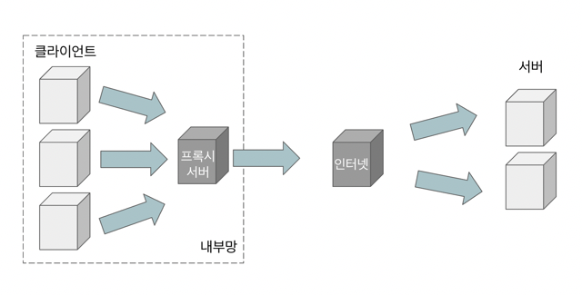
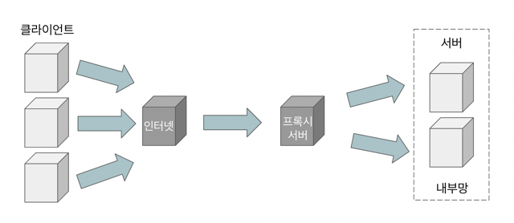

# Proxy
클라이언트가 자신을 통해서 다른 네트워크 서비스에 간접적으로 접속할 수 있게 해주는 컴퓨터 시스템이나 응용 프로그램을 말한다.

서버와 클라이언트 사이에서 대리로 통신하는 걸 `프록시`, 중계 역할을 하는걸 `프록시 서버` 라고 한다. 
프록시 서버 중 일부는 프록시 서버에 요청된 내용들을 캐시를 이용하여 저장한다.

프록시 서버가 중간에 위치하기 때문에 클라이언트는 프록시 서버를 서버라고 인식하고, 서버 입장에서는 프록시 서버를 클라이언트라고 인식한다. 
프록시 서버가 어디에 위치하냐에 따라 `Forward Proxy` 와 `Reverse Proxy` 로 나뉜다.

# Forward Proxy

일반적으로 말하는 프록시는 포워드 프록시를 말한다.

클라이언트가 서버에 요청을 할 때 직접 요청을 하지 않고 프록시 서버를 거쳐서 한다. 
이렇게 되면 서버에서 받는 IP는 클라이언트의 IP가 아니라 프록시 서버의 IP기 때문에 서버는 클라이언트를 알 수 없다.

즉, 서버에게 클라이언트가 누군지 감춰주는 역할을 한다.

## 포워드 프록시 장점
### 보안
보통 정부, 학교, 기업 등과 같은 곳은 해당 기관에 속한 사람의 인터넷 사용을 제한하기 위해 방화벽을 사용한다. 
해당 기관에 속한 사람이 웹사이트에 직접적으로 방문하는 것을 막는다.

즉, 포워드 프록시 서버는 방화벽과 같은 개념으로 제한을 위해 사용 된다. 
e.g. 포워드 프록시 서버에 규칙을 추가해서 특정 사이트에 접속 막기.

### 캐싱
웹 페이지에 접근하면 프록시 서버는 해당 페이지 서버의 정보를 캐싱한다. 
그래서 다시 해당 페이지에 접근하거나, 다른 클라이언트가 같은 요청할 때 캐시된 정보를 그대로 반환할 수 있다.

즉, 서버의 부하를 줄이는 효과를 낸다.

### 암호화
클라이언트의 요청은 포워드 프록시 서버를 통과할 때 암호화 된다. 
암호화된 요청은 다른 서버를 통과할 때 필요한 최소한의 정보만 갖는다.

따라서 서버에서 IP 주소를 역추적해도 포워드 프록시 서버를 사용하면 
IP 추적해도 포워드 프록시 서버 IP만 보이기 때문에 클라이언트의 정체를 파악하기 어렵다.

# Reverse Proxy

포워드 프록시의 반대 개념으로 애플리케이션 서버 앞에 위치하여 클라이언트가 서버에 요청을 할 때, 
리버스 프록시를 호출하고 리버스 프록시가 서버로부터 응답을 전달받아 다시 클라이언트에게 전송한다.

클라이언트는 웹 서비스에 접근할때 웹 서버에 요청하는 것이 아닌 프록시로 요청하게 되고, 프록시가 서버로부터 데이터를 가져온다.

## 리버스 프록시 장점
### 보안
리버스 프록시를 사용하면 서버의 IP 주소를 노출시키지 않을 수 있어서 서버 측 보안에 좋다. 
따라서 해커들의 DDoS 공격과 같은 공격을 막는데 유용하다.

### 캐싱
웹 페이지에 접근하면 프록시 서버는 해당 페이지 서버의 정보를 캐싱한다. 
그래서 다시 해당 페이지에 접근하거나, 다른 클라이언트가 같은 요청할 때 캐시된 정보를 그대로 반환할 수 있다.

즉, 서버의 부하를 줄이는 효과를 낸다.

### 암호화
서버가 클라이언트들과 통신할 때 SSL 또는 TSL로 암호화, 복호화를 할 경우 비용이 많이 든다. 
하지만 리버스 프록시를 사용하면 들어오는 요청을 모두 복호화 하고 나가는 응답을 암호화 하기 때문에 
클라이언트와 안전한 통신을 하게 만들고 서버의 부담을 줄여준다.

### 로드 밸런싱
리버스 프록시 서버를 여러 개의 서버 앞에 두면 특정 서버가 과부화 되지 않게 로드 밸런싱할 수 있다.

# 프록시를 사용하는 이유
보안상의 이유로 직접 통신할 수 없는 두 점 사이에서 대리로 통신을 수행하여 보안성, 성능, 안정성을 향상시킬 수 있기 때문이다.

# 포워드 프록시와 리버스 프록시 차이점
### 1. end point
포워드 프록시는 클라이언트가 요청하는 end point가 실제 서버이고, 프록시는 둘 사이의 통신을 담당한다. 
리버스 프록시는 클라이언트가 요청하는 end point가 프록시 서버이고, 클라이언트는 실제 서버의 정보를 알 수 없다.

### 2. 숨겨지는 대상
포워드 프록시는 클라이언트가 감춰지고 리버스 프록시는 서버가 감춰진다.

### 3. 프록시 서버 위치
포워드 프록시 서버는 클라이언트 뒤에 위치하고, 리버스 프록시는 서버 앞에 위치한다.

---

[^1] https://stackoverflow.com/questions/27796650/what-is-proxy-server-and-how-it-helps-in-server-architecture 
[^2] https://stackoverflow.com/questions/47893810/how-does-a-reverse-proxy-server-improve-your-security?rq=1
