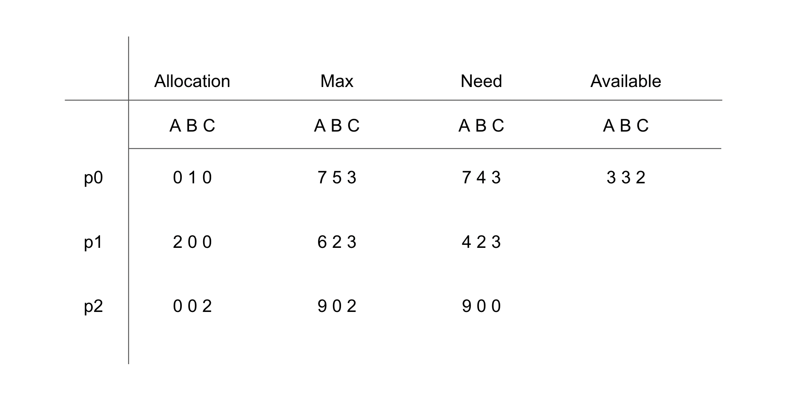

# DeadLock
프로세스가 자원을 얻지 못해 다음 처리를 하지 못하는 상태로, 교착 상태라고도 한다. 
시스템적으로 한정된 자원을 여러 곳에서 사용하려고 할 때 발생한다.

# DeadLock 발생하는 조건
데드락이 발생하기 위해서는 아래 4가지 모두 성립해야 한다. 하나라도 성립하지 않으면 데드락 문제 해결 가능하다.

### 1. 상호 배제
자원은 하나의 프로세스에서만 사용할 수 있어야 한다.

### 2. 점유 대기
최소한 하나 이상의 자원을 점유하고 있는 프로세스가 다른 자원을 기다릴 때 보유 자원을 놓지 않고 계속 점유하고 있어야 한다.

### 3. 비선점
다른 프로세스에 할당되어 사용하고 있는 자원은 강제로 빼앗을 수 없어야 한다.

### 4. 순환 대기
프로세스의 집합에서 P0은 P1이 점유한 자원을 대기하고 P1은 P2가 점유한 자원을 대기하고, 
Pn-1d은 Pn이 점유한 자원을 대기하며 Pn은 P0이 점유한 자원을 요구해야 한다.

# DeadLock 해결 방법
데드락을 해결하는 방법에는 크게 3가지가 있다.

- 데드락이 발생하지 않도록 예방하기
- 데드락 발생 가능성을 인정하면서도 적절하게 회피하기
- 데드락 발생을 허용하지만 데드락을 탐지하여, 데드락에서 회복하기

# 데드락 예방
데드락 발생하는 4가지 조건 중에서 하나라도 성립하지 않게 만드는 것이다. 하지만 이 방법은 시스템의 처리량이나 효율성을 떨어트릴 수 있다.

### 상호 배제 부정
한 번에 여러 프로세스가 공유 자원을 사용할 수 있게 하는 것이다. (하지만 나중에 동기화 관련 문제가 발생할 수 있다.)

### 점유 대기 부정
프로세스가 자원을 요청할 때 다른 어떤 자원도 가지지 않게 만드는 것이다.
- 프로세스 시작할 때 필요한 모든 자원을 할당해 주는 방법
- 다른 자원이 필요한 경우 할당 받은 자원은 내려 놓고 다시 요청을 하는 방법

### 비선점 부정
프로세스가 어떤 자원을 기다려야 하는 경우 이미 보유한 자원이 선점되게 하는 것이다. 
필요한 모든 자원을 얻을 수 있을 때 해당 프로세스는 다시 시작되고, 상태를 쉽게 저장하고 복구할 수 있는 자원에서 주로 사용한다. (cpu, memory)

### 순환 대기 부정
모든 자원에 순서를 부여하여 정해진 순서대로만 자원을 할당받을 수 있게 하는 것이다. 
e.g. 순서가 3인 R1 을 보유 중인 프로세스가 순서가 1인 R2를 할당받기 위해서는 우선 R1을 반납해야 한다.

# 데드락 회피
회피 알고리즘은 자원을 할당한 후에도 시스템이 항상 안전한 상태에 있을 때 할당을 허용하자는 것이 기본 특징이다. 
이런 특징을 사용한 알고리즘으로 유명한 것이 `은행원 알고리즘` 이다.

### 은행원 알고리즘
프로세스가 자원을 요청하면 자원이 남아있어 줄 수는 있지만 무조건 주는게 아니라 문제가 생길 수 있을 때는 자원이 남아있어도 주지 않는 것이다.

#### 은행원 알고리즘 시뮬레이션 
프로세스는 3개가 있다 - p0, p1, p2 
자원도 3개가 있다 -  A(8), B(5), c(4)

Allocation: 할당 받은 자원의 양이다. 
Max:  해당 프로세스가 최대로 요청하는 자원의 요청량이다. 
Need: 작업을 처리하는데 남은 필요한 자원의 양이다. `Max - Allocation` 을 하면 된다. 
Available: 사용할 수 있는 자원의 양이다.

**만약 p0에서 A자원 3개 B자원 3개 C자원 2개를 요청하면 어떻게 될까?**

가용 자원의 양은 충분히 p0에게 요청대로 할당해 줄 수 있는 상황이지만 가용 자원만으로 최대 요청을 할 경우 충족할 수 없기 때문에 자원을 할당해 주지 않는다.  
그 이유는 p0에게 자원을 할당해 줬을 때 갑자기 p0이 최대 요청을 보내버리면 가용 자원으로만 처리할 수 없기 때문이다. 

가용 자원으로 최대 요청을 충족할 수 있는 프로세스에게는 자원을 할당해줘서 처리해버림으로 인해 해당 프로세스가 사용하던 자원들이 가용 자원으로 더 추가된다.
나중에 가용 자원만으로 처리가 가능한 상황이 왔을 때 충족 안되던 프로세스에게 자원을 나눠줄 수 있다.

# 데드락 탐지 및 회복
먼저 시스템이 데드락 예방이나 회피법을 사용하지 않았을 때, 데드락이 발생할 수 있으니 데드락을 탐지하고 회복하는 알고리즘을 사용한다.

### 탐지 기법
Allocation, Request, Available 등으로 시스템에 데드락이 발생했는지 여부를 탐색한다. 
즉, 은행원 알고리즘에서 했던 방식과 유사하게 현재 시스템의 자원 할당 상태를 가지고 파악한다. 
이 외에도 자원 할당 그래프를 통해 탐지하는 방법도 있다.

### 회복 기법
데드락 탐지 기법을 통해 발견했다면 순환 대기에서 벗어나 데드락을 회복하기 위한 방법을 사용한다.

첫 번째 방법은 단순히 프로세스 1개 이상을 중단시키는 것인데 이건 또 **교착 상태에 빠진 모든 프로세스를 중단시키는 것** 과 
**프로세스 하나 중단 시킬 때마다 탐지 알고리즘으로 데드락을 탐지하면서 회복시키는 것** 으로 나뉜다.

두 번째 방법은 프로세스에 할당된 자원을 선점해서, 교착 상태를 해결할 때까지 그 자원을 다른 프로세스에 할당해 주는 방법이다. 

> ### 프로세스 1개 이상을 중단시키는 방법 비교
> 교착 상태에 빠진 모든 프로세스를 중단시키는 방법은 
> 계속 연산중이던 프로세스들도 모두 동시에 중단돼 부분 결과가 폐기될 수 있는 부작용이 발생할 수 있다.
>  
>
> 프로세스 하나 중단 시킬 때마다 탐지 알고리즘으로 데드락 탐지하면서 회복시키는 방법은 
> 매번 탐지 알고리즘을 호출 및 수행해야 해서 부담이 되는 작업일 수 있다.

---

[^1] https://stackoverflow.com/questions/34512/what-is-a-deadlock 
[^2] http://www.kocw.net/home/cview.do?lid=a1bfe7f08156cb36 
[^3] http://www.kocw.net/home/cview.do?lid=7351cb56948b1c9a
