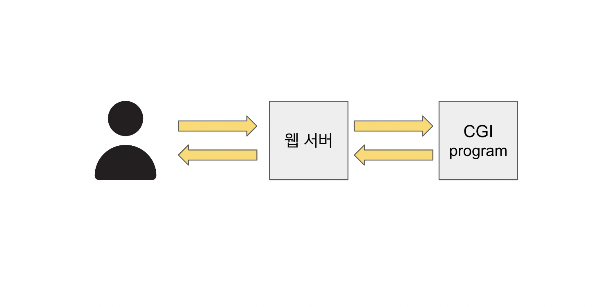
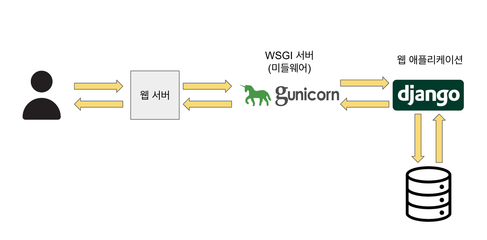

# CGI

Common Gateway Interface의 약자이다. 웹 서버와 외부 프로그램 사이에 정보를 주고 받는 방법이나 규약들을 말한다. 
이 규약에 맞춰 만들어진게 CGI 스크립트 또는 CGI 프로그램이다. CGI 프로그램은 아무 프로그래밍 언어로도 만들 수 있다.

웹 서버의 기능은 미리 준비된 정적 페이지를 사용자의 요청에 맞게 반환해주는 것이다.
웹 서버에서는 정적인 데이터만 처리할 수 있어서 동적인 데이터를 처리하기 위해서 외부에 동적인 처리를 해주는 프로그램을 만들었다.
그래서 동적인 요청이 들어왔을 때 웹 서버에서 외부 프로그램을 불러내고, 그 처리 결과를 클라이언트에게 송신하는 방법이 고안됐다.

위의 방법을 실현하기 위해 웹 서버와 외부 프로그램을 연결하는 방법을 정하게 됐는데 이게 CGI다.

## CGI 구조
1. HTML 폼을 통해 요청이 웹 서버에 전달된다.
2. 웹 서버는 요청에 들어있는 주소가 CGI에 대응하는 주소인지 확인한다.
3. 대응되면 그 프로그램을 실행시켜서 환경 변수와 표준 입력의 형태로 요청을 전달한다.
4. 웹 서버는 CGI 프로그램이 표준 출력으로 반환한 내용을 그대로 응답에 보내준다.

# WSGI
Web Server Gateway Interface의 약자이다. CGI의 가장 큰 단점인 요청이 들어올 때마다 새로운 프로세스를 생성하는 걸 보완하기 위해서 만들어졌다. 
Callable Object를 통해서 웹 서버가 요청한 정보를 웹 애플리케이션에 전달한다.

Callable Object는 함수나 객체의 형태가 될 수 있고, 웹 서버는 Callable Object를 통해서 2가지 정보를 줘야 한다.
1. HTTP Request 에 대한 정보 (Method, URL, data ...)
2. Callback 함수

### WSGI Middleware
인증, 라우팅, 세션, 쿠키, 에러 페이지 보여주기 등의 기능을 추가해주며 파이썬 웹 프레임워크와 함께 사용된다. 
WSGI Middleware에는 `uWSGI`, `Gunicorn`, `Werkzeug` 등이 있다.

## WSGI 작동 순서

1. 클라이언트가 요청을 보낸다.
2. 웹 서버에서 요청을 받아 동적인 요청이라면 WSGI 서버를 호출한다.
3. WSGI 서버는 WSGI를 사용하는 웹 애플리케이션을 호출한다.
4. 호출받은 웹 애플리케이션은 요청에 따라 적절한 행동을 취한다.
5. 결과를 다시 WSGI 서버를 통해 웹 서버에 전달하고 웹 서버는 클라이언트에게 보낸다.

# WSGI이 필요한 이유
웹 서버에서는 정적인 페이지만 보여줄 수 있다. 동적인 페이지들은 웹 애플리케이션인 Django, Flask 등의 도움을 받는다.
정적, 동적 데이터를 처리하기 위해서는 웹 서버와 웹 애플리케이션이 서로 소통을 할 수 있어야 한다.
하지만 Apache 등의 웹 서버는 자바 기반으로 작성됐기 때문에 파이썬 코드를 이해하지 못한다.
그래서 웹 서버와 파이썬 애플리케이션은 바로 소통을 할 수 없다.
이를 해결하기 위해 웹 서버와 파이썬 애플리케이션 사이에서 인터페이스 역할을 해주는 역할이 필요한데 이걸 WSGI가 해주기 때문이다.

---

[^1] https://wsgi.readthedocs.io/en/latest/ 
[^2] https://stackoverflow.com/questions/4929626/what-are-wsgi-and-cgi-in-plain-english 
[^3] https://apirobot.me/posts/what-is-wsgi-and-why-do-you-need-gunicorn-and-nginx-in-django